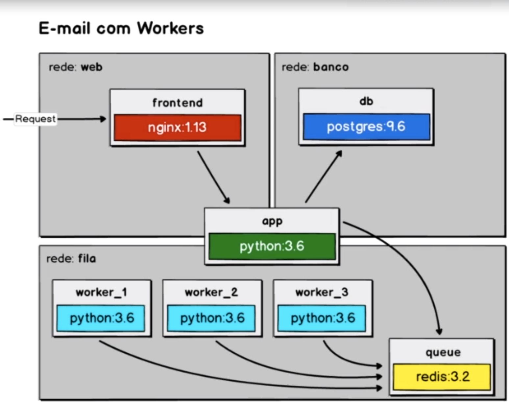

# Guia de Configuração - Aplicação de Envio de E-mails

Este guia fornecerá uma visão geral de como configurar e executar nossa aplicação de envio de e-mails.

## Sumário

- [Iniciando a Composição com o Banco de Dados](#iniciando-a-composição-com-o-banco-de-dados)
- [Usando Volumes e Scripts de Banco de Dados](#usando-volumes-e-scripts-de-banco-de-dados)
- [Começando Nossa Camada de Front-end](#começando-nossa-camada-de-front-end)
- [Aplicativo para Enfileirar as Mensagens](#aplicativo-para-enfileirar-as-mensagens)
- [Configurando um Proxy Reverso](#configurando-um-proxy-reverso)
- [Redes, Dependências e Banco de Dados](#redes-dependências-e-banco-de-dados)
- [Filas e Workers](#filas-e-workers)
- [Escalar é Preciso...](#escalar-é-preciso)
- [12 Factors](#12-factors)
- [Sobregravando Localmente](#sobregravando-localmente)

## Iniciando a Composição com o Banco de Dados

Nesta seção, explicaremos como iniciar a composição do aplicativo com o banco de dados.

## Usando Volumes e Scripts de Banco de Dados

Aqui, discutiremos como usar volumes e scripts para configurar e popular o banco de dados.

## Começando Nossa Camada de Front-end

Nesta etapa, abordaremos como iniciar a camada de front-end de nosso aplicativo.

## Aplicativo para Enfileirar as Mensagens

Detalharemos como configurar o aplicativo que lida com a enfileiração de mensagens.

## Configurando um Proxy Reverso

Explicaremos como configurar um proxy reverso para gerenciar solicitações.

## Redes, Dependências e Banco de Dados

Discutiremos como configurar redes, gerenciar dependências e otimizar o banco de dados.

## Filas e Workers

Mostraremos como configurar filas e workers para processar mensagens em segundo plano.

## Escalar é Preciso...

Esta seção falará sobre a escalabilidade de nossa aplicação e como escalá-la quando necessário.

## 12 Factors

Discutiremos os 12 fatores a serem considerados ao desenvolver e implantar aplicativos modernos.

## Sobregravando Localmente

Explicaremos como é possível sobrescrever configurações localmente para fins de desenvolvimento.

---

Esperamos que este guia seja útil para você ao configurar nossa aplicação de envio de e-mails. Se você tiver alguma dúvida ou encontrar problemas, não hesite em entrar em contato conosco.

[Email de Suporte](mailto:felipesvascon@gmail.com)